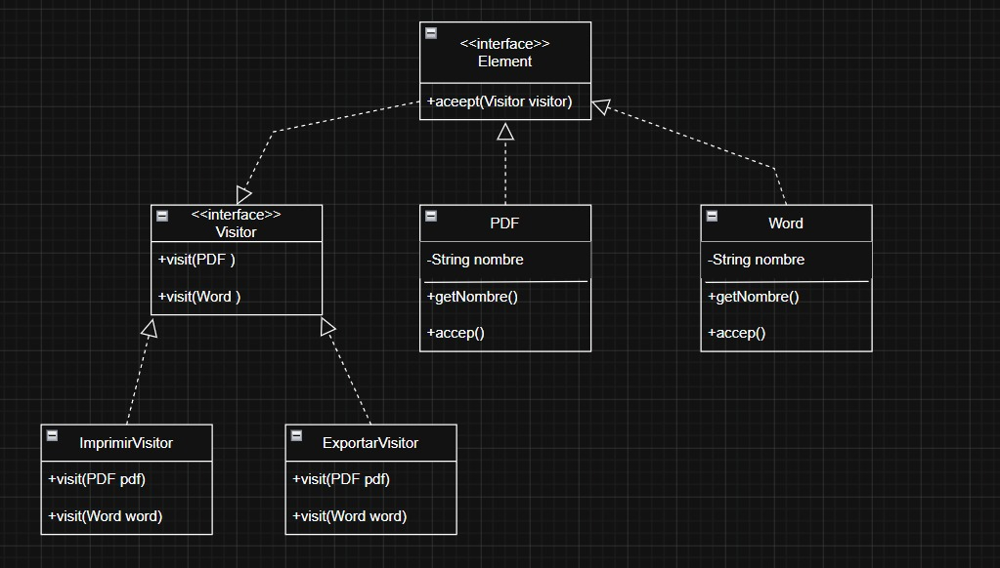

# Visitor

**Categoría:** De comportamiento 🟡
**Responsables:** Nicol Mariana Gómez Soto y Yury Vanessa Romero Zapata 

> 👫 Este patrón se desarrolla en pareja.

## 📌 Problema

En muchos sistemas existen diferentes tipos de objetos sobre los que se necesitan realizar varias operaciones. Cuando se agregan nuevas funcionalidades, es necesario modificar todas las clases involucradas, lo que aumenta el mantenimiento del código y puede violar el principio de abierto/cerrado (Open/Closed Principle).

Por ejemplo, en un sistema de documentos existen archivos PDF y Word. Si se desea imprimirlos, exportarlos o analizarlos, habría que agregar métodos nuevos en cada clase cada vez que aparezca una nueva operación.

## 💡 Solución

El patrón Visitor permite separar los algoritmos de los objetos sobre los que operan. Para ello, se define una interfaz Visitor que contiene un método para cada tipo de elemento.

Cada objeto acepta un visitante mediante el método `accept()`, permitiendo que las operaciones se agreguen sin modificar las clases existentes.

De esta manera es posible crear nuevos visitantes para implementar nuevas funcionalidades sin alterar la estructura de los objetos.

## 🧭 Estructura / Diagrama



Participantes principales:

* **Visitor:** declara las operaciones para cada tipo de elemento.
* **ConcreteVisitor:** implementa las operaciones específicas.
* **Element:** define el método `accept()`.
* **ConcreteElement:** implementa el método `accept()` y permite que el visitante actúe sobre él.

Estructura simplificada:

```text
Visitor
 ├── ImprimirVisitor
 └── ExportarVisitor

Element
 ├── PDF
 └── Word