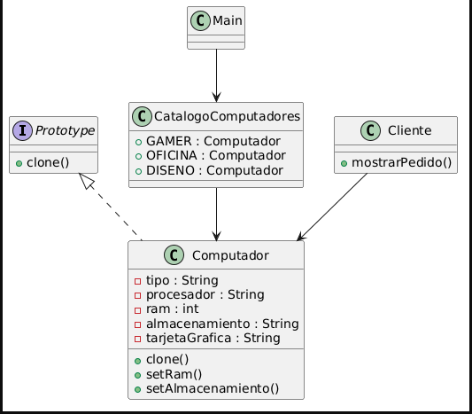

# Prototype

**Categoría:** Creacional 🟣 · **Responsable:** Yuliana Bedoya Ortiz 

## 📌 Problema
En una tienda de tecnología se manejan diferentes configuraciones de computadores como Gamer, Oficina y Diseño. Cada uno tiene características específicas como procesador, memoria RAM, almacenamiento y tarjeta gráfica.

Si cada vez que un cliente solicita un equipo se debe crear desde cero, el proceso se vuelve repetitivo, propenso a errores y poco eficiente, ya que muchas configuraciones son similares entre sí.

## 💡 Solución
El patrón Prototype permite crear nuevos objetos a partir de la clonación de un objeto existente llamado prototipo.

En lugar de construir cada computador desde cero, el sistema mantiene configuraciones base (prototipos) como Gamer, Oficina y Diseño. Cuando un cliente solicita un equipo, se clona el prototipo correspondiente y luego se modifican únicamente los atributos necesarios.

Esto reduce la duplicación de código, mejora la eficiencia y facilita la creación de objetos complejos.

## 🧭 Estructura / Diagrama

## 🧪 Ejemplo de uso
En una tienda de computadores existen tres configuraciones base:

Gamer: alto rendimiento para videojuegos
Oficina: rendimiento básico para trabajo diario
Diseño: alto rendimiento para edición gráfica

Cuando un cliente solicita un computador Gamer con más memoria RAM, el sistema no crea el objeto desde cero. En su lugar, clona el prototipo Gamer y modifica únicamente la RAM a 32 GB.

Lo mismo ocurre con otros clientes que desean modificar solo algunas partes de la configuración base.

## ▶️ Cómo ejecutar
_Instrucciones para correr tu demo._

🗂️ Estructura de la carpeta
prototype/
├── README.md
├── src/
│   ├── CatalogoComputadores.java
│   ├── Cliente.java
│   ├── Computador.java
│   ├── Demo.java
│   └── Prototype.java
├── examples/
│   └── ejemplodeuso.md
├── diagrams/
│   └── diagrama.png
└── tests/
