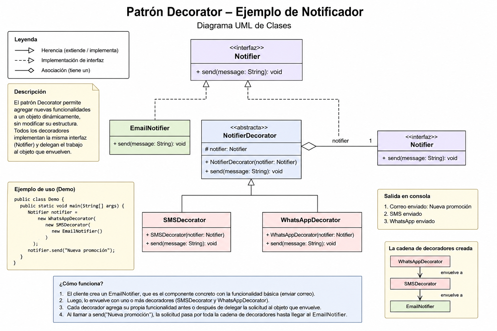

# Decorator

**Categoría:** Estructural 🟢 · **Responsable:** Yurani Álvarez

---

## 📌 Problema

Cuando una aplicación necesita agregar nuevas funcionalidades a un objeto sin modificar su código original ni crear una gran cantidad de subclases.

Por ejemplo, una biblioteca de notificaciones inicialmente solo envía correos electrónicos, pero posteriormente necesita agregar envío por SMS y WhatsApp.

Sin utilizar el patrón Decorator podrían aparecer múltiples clases como:

- EmailNotifier
- EmailSMSNotifier
- EmailWhatsAppNotifier
- EmailSMSWhatsAppNotifier

Este enfoque hace que el sistema sea más difícil de mantener y extender.

---

## 💡 Solución

El patrón Decorator permite agregar funcionalidades adicionales a un objeto de forma dinámica mediante objetos decoradores.

Cada decorador mantiene la misma interfaz del objeto original y añade comportamiento antes o después de ejecutar la funcionalidad principal.

Esto permite combinar funcionalidades sin modificar las clases existentes.

---

## 🧭 Estructura / Diagrama

A continuación se presenta el diagrama UML correspondiente a la implementación del patrón Decorator.



---

## 🧪 Ejemplo de uso

En este ejemplo se construye una notificación utilizando varias capas de decoradores.

Flujo de envío:

```text
Correo → SMS → WhatsApp
```

Código utilizado:

```java
Notifier notifier =
    new WhatsAppDecorator(
        new SMSDecorator(
            new EmailNotifier()
        )
    );

notifier.send("Nueva promoción");
```

Salida esperada:

```text
Correo enviado: Nueva promoción
SMS enviado
WhatsApp enviado
```

Explicación:

1. EmailNotifier envía la notificación principal.
2. SMSDecorator agrega envío por SMS.
3. WhatsAppDecorator agrega envío por WhatsApp.
4. Cada decorador mantiene la misma interfaz y agrega funcionalidad adicional.

---

## ▶️ Cómo ejecutar

1. Abrir la carpeta `src/`.
2. Ejecutar la clase `Demo.java`.

Desde terminal:

```bash
cd src
javac *.java
java Demo
```

Resultado esperado:

```text
Correo enviado: Nueva promoción
SMS enviado
WhatsApp enviado
```

---

## 🗂️ Estructura de la carpeta

```text
decorator/
│
├── README.md
│
├── diagrams/
│   └── Diagrama.png
│
├── examples/
│   └── example.md
│
├── src/
│   ├── Demo.java
│   ├── EmailNotifier.java
│   ├── Notifier.java
│   ├── NotifierDecorator.java
│   ├── SMSDecorator.java
│   └── WhatsAppDecorator.java
│
└── tests/
    └── decorator-test.md
```

---

## ✅ Resultado

La implementación demuestra cómo el patrón Decorator permite agregar funcionalidades dinámicamente utilizando composición y evitando crear múltiples subclases.

En este ejemplo, una notificación puede enviarse por correo electrónico y extenderse posteriormente con SMS y WhatsApp sin modificar la clase original.